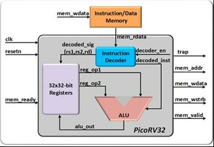

# 01. picorv32 notes 架構分析 

- picorv32  
  - Memory Interface  
  - Instruction Decoder
  - Main State Machine

- picorv32_regs

- picorv32_pcpi_mul               // A PCPI core that implements the MUL[H[SU|U]] instructions

- picorv32_pcpi_fast_mul          // A version of picorv32_pcpi_fast_mul using a single cycle multiplier

- picorv32_pcpi_div               // A PCPI core that implements the DIV[U]/REM[U] instructions

- picorv32_axi                    // The version of the CPU with AXI4-Lite interface

- picorv32_axi_adapter            // Adapter from PicoRV32 Memory Interface to AXI4-Lite

- picorv32_wb                     // The version of the CPU with Wishbone Master interface


## 1. 模組介紹與變體

| 模組名稱             | 描述                                  |
| ----------           | ------                                |
| picorv32             | 使用 native memory interface 的主 CPU |
| picorv32_axi         | 提供 AXI4-Lite master 介面的 CPU      |
| picorv32_axi_adapter | native memory ↔ AXI4 bridge           |
| picorv32_wb          | Wishbone master 介面                  |
| picorv32_pcpi_*      | 外接乘法 / 除法協同處理器             |

## 2. CPU Top-level Interface

| Signal          | Direction   | Description               |
| --------        | ----------- | -------------             |
| `clk`, `resetn` | input       | 時鐘與非同步 reset        |
| `mem_*`         | mixed       | native memory interface   |
| `mem_la_*`      | output      | look-ahead memory signals |  
| `pcpi_*`        | mixed       | 外接協同處理器接口        |
| `irq`, `eoi`    | mixed       | 中斷處理相關              |

> 註：AXI / Wishbone 模式會包裝 picorv32 核心。


- picorv32 ino/out port 的 Look-Ahead Interface :  
```verilog
output        mem_la_read;   // 下一個週期是否為讀取
output        mem_la_write;  // 下一個週期是否為寫入
output [31:0] mem_la_addr;   // 下一個週期的目標地址
output [31:0] mem_la_wdata;  // 寫入資料（若為 write）
output [ 3:0] mem_la_wstrb;  // 寫入掩碼（byte enable）
```
如果外部記憶體可以提前知道下一筆要做什麼，就能加快反應速度 → 減少等待週期。  
這些訊號在 mem_valid 前一個週期就會被設定好。  
| 時間週期    | 事件                           |
| --------- | ------------------------      |
| cycle N   | `mem_la_read` = 1，預告將讀取    |
| cycle N+1 | `mem_valid` = 1，正式啟動讀取行為 |
這樣 memory controller 就可以在 cycle N 就開始準備，例如預讀 SRAM 或預取 AXI transaction。

以上說的是好處，但要特別注意的是  
  1. Look-Ahead Interface 是 *組合邏輯輸出*，因此會拉長 critical path（設計時要小心時序）。  
  2. 在某些設計中，可能會比 standard interface 更難達成 *timing closure*。


## 3. 狀態機與指令流程簡述

- FSM 定義位置：`state` enum 宣告處
- 每個狀態代表的行為：
  - `FETCH_INSTR`
  - `DECODE`
  - `EXECUTE`
  - `MEM_ACCESS`
  - `TRAP`, 等等

> 可搭配 waveform / trace log 分析每個狀態下的 bus 行為

## 4. 架構重點摘要

- 單指令 1 cycle commit？
- CPI 效能？
- 有哪些參數可設定？
- 是否支援 Compressed ISA、IRQ、PCPI？

---

##  picorv32.v 架構圖解（邏輯模組層級）

```text
                           +-----------------------+
                           |      IRQ Engine       |<-- irq, eoi
                           +-----------------------+
                                   |
                                   ▼
 +----------+    +-----------+    +-----------+    +------------------+
 | Decode & |--->|  ALU /    |--->| Memory /  |--->| Memory Interface |
 | Control  |    |  Shifter  |    | Load/Store|    |  (native / AXI)  |
 +----------+    +-----------+    +-----------+    +------------------+
      ▲                ▲                ▲                    ▲
      |                |                |                    |
      |                |                |                    |
 +------------+   +-----------+     +----------+       +--------------+
 |  Register  |<--| PCPI (if  |<----|  Program |<------| External RAM |
 |   File     |   | enabled)  |     | Counter  |       | or Periphs   |
 +------------+   +-----------+     +----------+       +--------------+
```




## Reference
Kanda, Guard & Ryoo, Kwangki. (2022). Design of an Integrated Cryptographic SoC Architecture for Resource-Constrained Devices. International Journal of Electrical and Electronics Research. 10. 230-244. 10.37391/ijeer.100231. 